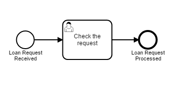
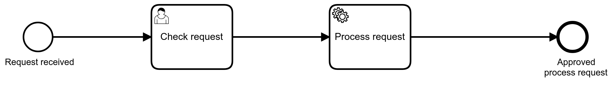

## Старт с Camunda и Spring Boot

[Источник](https://docs.camunda.org/get-started/spring-boot/)

Выполнен в виде war-файла.
Пример показывает запуск простейшего camunda-процесса.



```java
@EnableProcessApplication
@SpringBootApplication
public class SpringBootFirstApplication {

	@Autowired
	private RuntimeService runtimeService;

	public static void main(String[] args) {
		SpringApplication.run(SpringBootFirstApplication.class, args);
	}

	@EventListener
	private void processPostDeploy(PostDeployEvent event) {
		// "process_request" - ID процесса в modeler
		runtimeService.startProcessInstanceByKey("process_request");
	}

}

```

После деплоя, перейти по ссылке
[http://127.0.0.1:8080/spring-boot-first-1](http://127.0.0.1:8080/spring-boot-first-1)

Добавлена обработка принятых параметров сервисом (делегатом) в виде метода java-класса



```java
public class ProcessRequestDelegate implements JavaDelegate {

  private final static Logger LOGGER = LoggerFactory.getLogger(ProcessRequestDelegate.class);

  public void execute(DelegateExecution execution) throws Exception {
    LOGGER.info("Processing request by '" + execution.getVariable("customerId") + "'...");
  }
}
```

### Тестовый пример

Для проверки развернут сервис по адресу [http://v.perm.ru:8080/spring-boot-first-1](http://v.perm.ru:8080/spring-boot-first-1)

Login: vasi
Password: pass

Перейти в *Task list*, выбрать в меню "Start Process"
